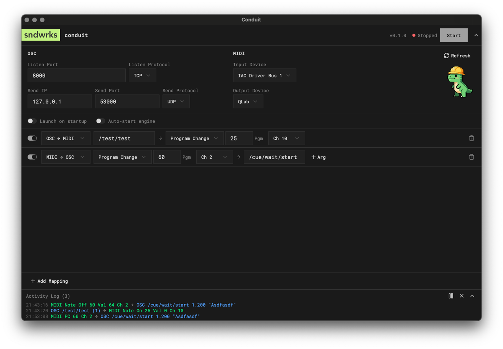

# Conduit

A cross-platform desktop application that bridges OSC (Open Sound Control) and MIDI protocols. Very much written with a lot of help from AI, but this is tested and will be actively maintained, and we use it #dogfooding.

We made this because we were sad osculator went away. RIP. 



## Install

Download the appropriate file for your system from the latest release.

### macOS (Apple Silicon)

Download the `macos-arm64` file. After downloading, right-click the app and select "Open". If that doesn't work, go to System Settings > Privacy & Security and click "Open Anyway" next to the blocked app message. Apple code signing is coming soon.

### macOS (Intel)

Download the `macos-x64` file. Follow the same steps as above to allow the app to run.

### Windows

Download the `windows-x64` installer and run it. Windows may show a SmartScreen warning—click "More info" and then "Run anyway".

### Linux

Download the `linux-x64` AppImage or deb file. For AppImage, make it executable with `chmod +x` and run it. For deb, install with your package manager.

> [!NOTE]
> I only currently have a Mac with an ARM processor easily available. Please open an issue if it doesn't work on your OS.

## Settings

In the top right corner, there's a settings icon. Click on that to open it.

> [!IMPORTANT]
> You cannot change the settings while the app is running. Please click stop to edit the settings.

### OSC

The app can receive and send [osc](https://opensoundcontrol.stanford.edu/) via `tcp` or `udp`. The TCP implementation uses SLIP to frame it. This is a part of the 1.1 spec of osc and is supported by apps like Qlab and ETC EOS.

**Incoming**

The app listens to all available interfaces by binding to `0.0.0.0`.

| Name | Example | Notes |
| --- | --- | --- |
| Listen Port | `53000` | This value must be between 1024 and 65535 |
| Listen Protocol | `UDP` | This is where you select what port the app should listen to. |

**Outgoing**

The outgoing section sets where the app sends the osc when doing MIDI -> OSC maps.

| Name | Example | Notes |
| --- | --- | --- |
| Send IP | `192.168.100.12` | This must be a valid ip address |
| Send Port | `8000` | The port that the app should send to |
| Send Protocol | `TCP` | The transport protocol to use |

### MIDI

The app can send and listen to one MIDI source. If you don't see your source, click `Refresh Devices` above the construction dino to reload the lists.

### Launch on startup

This option allows the app to open on computer startup. This is useful for shows where you want your show computer to launch all it's applications it needs without an operator having to do that manually

### Auto-start engine

When you open the app, it will automatically start running the engine. This means that all mapping functions will be engaged.

## Usage

After you've set the settings you like go ahead and click `Start`. The app will say running.

### Mapping rows

Click `+ Add Mapping` at the bottom of the app. This is the juice of the app. It allows you to select `MIDI -> OSC` or `OSC -> MIDI` and select an address.
 
**MIDI**

MIDI can listen to specific channel/velocity combinations or ignore velocity with `Vel Any`. Right now the available values are `Note On`, `Note Off`, `CC`, and `Program Change` messages. You also must specify a channel to listen to. MIDI values can also be mapped to OSC Args via the dropdown after adding an arg.

**OSC**

OSC can listen to specific addresses. It can also map `float` args to midi values `0-1.0` -> `1-127`. You can also specify a static output for the MIDI value. Additionally, you can add as many args as you like. They'll show up in the sent osc message like this `/address/yay arg arg arg`.

## Development

- Rust toolchain (install via [rustup](https://rustup.rs))
- Node.js 18+
- npm 9+

**Linux additional deps:**

```bash
sudo apt-get install -y libgtk-3-dev libwebkit2gtk-4.1-dev \
  libappindicator3-dev librsvg2-dev patchelf libasound2-dev
```

### Install and Run

```bash
npm install
npm run tauri dev
```

### Build

```bash
npm run tauri build
```

### Testing

```bash
# Frontend tests
npm test

# Lint
npm run lint

# Type check
npm run typecheck

# Rust tests
cd src-tauri && cargo test --workspace
```

### Architecture

```
src/                    # React frontend (TypeScript)
  components/           # UI components (shadcn/ui)
  hooks/                # State management hooks
  lib/                  # Utilities (MIDI, events)
  types.ts              # Shared type definitions
src-tauri/              # Rust backend
  src/
    lib.rs              # App entry, command registration
    commands/           # IPC command handlers
    router.rs           # Message routing/matching engine
    osc_engine.rs       # OSC listener + sender (UDP/TCP)
    midi_engine.rs      # MIDI I/O (midir)
    models.rs           # Shared data types
    config.rs           # Settings persistence (JSON)
    state.rs            # Application state
```

